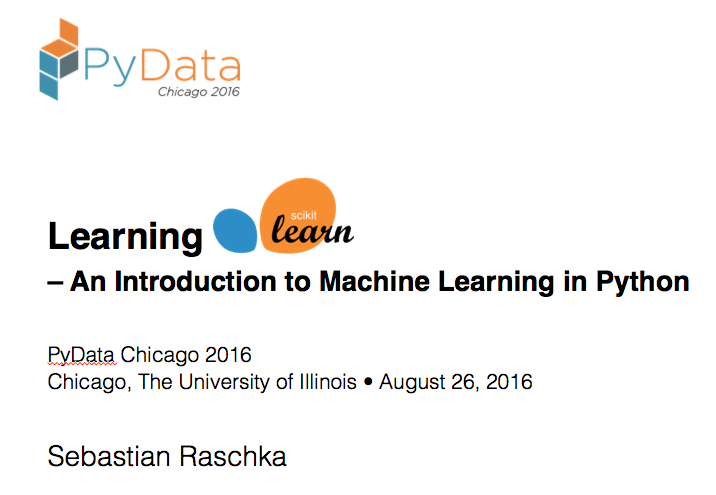
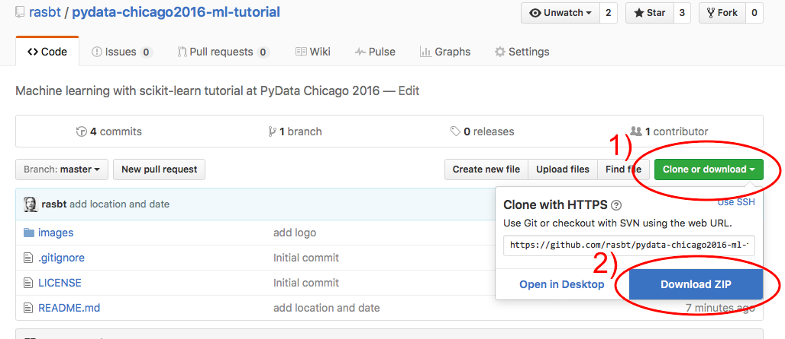

# pydata-chicago2016-ml-tutorial

### Learning scikit-learn -- An Introduction to Machine Learning in Python @ PyData Chicago 2016

*This tutorial provides you with a comprehensive introduction to machine learning in Python using the popular scikit-learn library. We will learn how to tackle common problems in predictive modeling and clustering analysis that can be used in real-world problems, in business and in research applications. And we will implement certain algorithms as scratch as well, to internalize the inner workings of the scikit-learn API.*

This tutorial will teach you the basics of scikit-learn. We will learn how to leverage powerful algorithms from the two main domains of machine learning: supervised and unsupervised learning. In this talk, I will give you a brief overview of the basic concepts of classification and regression analysis, how to build powerful predictive models from labeled data. Furthermore, we will go over the basics of clustering analysis to discover hidden structures in unlabeled data. Although it's not a requirement for attending this tutorial, I highly recommend you to check out the accompanying GitHub repository at https://github.com/rasbt/pydata-chicago2016-ml-tutorial 1-2 days before the tutorial. During the session, we will not only talk about scikit-learn, but we will also go over some live code examples and code simple machine-learning algorithms from scratch to get the knack of scikit-learn's API.   

If you have any questions about the tutorial, please don't hesitate to contact me. You can either open an "issue" on GitHub or reach me via email at mail_at_sebastianraschka.com. I am looking forward to meeting you soon!

---

# Schedule

This repository will contain the teaching material and other info for the *Learning scikit-learn* tutorial at the [PyData Chicago 2016 Conference](http://pydata.org/chicago2016/) held Aug 26-28. The tutorial session takes place in Room 1 on Friday Aug. 26, 2016 at 9:00 am.

# Obtaining the Tutorial Material

If you already have a GitHub account, the probably most convenient way to obtain the tutorial material is to clone this GitHub repository via `git clone https://github.com/rasbt/scipy-2016-sklearn.git` and fetch updates via `pull origin master`

If you don’t have an GitHub account, you can download the repository as a .zip file by heading over to the GitHub repository (https://github.com/rasbt/scipy-2016-sklearn) in your browser and click the green “Download” button in the upper right.

